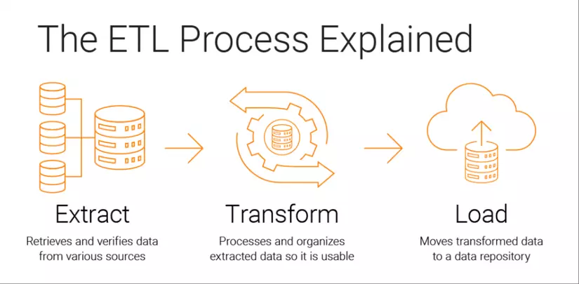

# Tìm hiểu về quy trình ETL (Extract, Transform, Load)

## 1. Trích xuất (Extract)

Bước đầu tiên của quy trình ETL là **Trích xuất**. Trong bước này, dữ liệu được thu thập từ nhiều nguồn khác nhau, có thể là cơ sở dữ liệu SQL, hệ thống CRM, tệp CSV, trang web, v.v. Mục tiêu của việc trích xuất là thu thập toàn bộ dữ liệu cần thiết cho quá trình phân tích hoặc quản lý dữ liệu. Quy trình trích xuất cần được thiết kế một cách cẩn thận để đảm bảo không có dữ liệu nào bị mất hoặc bị thay đổi trong quá trình này.

## 2. Chuyển đổi (Transform)

Sau khi dữ liệu đã được trích xuất, bước tiếp theo là **Chuyển đổi**. Trong bước này, dữ liệu được chuẩn hóa và biến đổi để phù hợp với mô hình dữ liệu hoặc cơ sở dữ liệu mục tiêu. Quá trình chuyển đổi có thể bao gồm việc làm sạch dữ liệu (loại bỏ dữ liệu không hợp lệ hoặc không liên quan), việc hợp nhất dữ liệu từ các nguồn khác nhau, và việc chuyển đổi định dạng dữ liệu để đảm bảo tính nhất quán.

## 3. Tải (Load)

Bước cuối cùng của quy trình ETL là **Tải**. Sau khi dữ liệu đã được chuẩn bị và chuyển đổi, nó sẽ được tải vào kho dữ liệu hoặc cơ sở dữ liệu mục tiêu. Việc tải có thể được thực hiện theo lịch trình hoặc theo yêu cầu, tùy thuộc vào nhu cầu của tổ chức.

---

## Giải thích sâu hơn

### 1. Trích xuất dữ liệu là gì?
Trong quá trình trích xuất dữ liệu, các công cụ trích xuất, chuyển đổi và tải (ETL) sẽ trích xuất hoặc sao chép dữ liệu thô từ nhiều nguồn và lưu trữ chúng trong một khu vực lưu đệm. Khu vực lưu đệm (hay còn gọi là vùng đích) là khu vực lưu trữ trung gian để lưu tạm thời dữ liệu đã trích xuất. Các khu vực lưu đệm dữ liệu thường mang tính tạm thời, có nghĩa là nội dung của chúng sẽ bị xóa sau khi quá trình trích xuất dữ liệu hoàn tất. Tuy nhiên, khu vực lưu đệm cũng có thể giữ lại một kho lưu trữ dữ liệu nhằm mục đích khắc phục sự cố.

Tần suất hệ thống gửi dữ liệu từ nguồn dữ liệu đến kho dữ liệu đích phụ thuộc vào cơ chế cơ sở về thu thập thay đổi dữ liệu. Việc trích xuất dữ liệu thường diễn ra theo một trong ba cách sau.

#### Thông báo cập nhật
Trong quá trình thông báo cập nhật, hệ thống nguồn sẽ thông báo cho bạn khi bản ghi dữ liệu thay đổi. Sau đó, bạn có thể chạy quá trình trích xuất đối với thay đổi đó. Hầu hết các cơ sở dữ liệu và ứng dụng web đều cung cấp các cơ chế cập nhật để hỗ trợ phương pháp tích hợp dữ liệu này.

#### Trích xuất tăng dần
Một số nguồn dữ liệu không thể gửi thông báo cập nhật nhưng có thể xác định và trích xuất dữ liệu đã được sửa đổi trong một khoảng thời gian nhất định. Trong trường hợp này, hệ thống kiểm tra các thay đổi theo định kỳ, chẳng hạn như mỗi tuần một lần, mỗi tháng một lần hoặc khi kết thúc chiến dịch. Bạn chỉ cần trích xuất dữ liệu đã thay đổi.

#### Trích xuất hoàn toàn
Một số hệ thống không thể xác định các thay đổi dữ liệu hoặc gửi thông báo, do đó, tải lại tất cả dữ liệu là lựa chọn duy nhất. Phương pháp trích xuất này yêu cầu bạn giữ một bản sao của lần trích xuất cuối cùng để kiểm tra xem bản ghi nào là bản ghi mới. Bởi vì cách tiếp cận này có khối lượng truyền dữ liệu cao, chúng tôi khuyên bạn chỉ nên sử dụng cách này cho các bảng nhỏ.

### 2. Chuyển đổi dữ liệu là gì?
Trong chuyển đổi dữ liệu, các công cụ trích xuất, chuyển đổi và tải (ETL) sẽ chuyển đổi và hợp nhất dữ liệu thô trong khu vực lưu đệm để chuẩn bị cho kho dữ liệu đích. Giai đoạn chuyển đổi dữ liệu có thể liên quan đến các loại thay đổi dữ liệu sau đây.

#### a. Chuyển đổi dữ liệu cơ bản
Các chuyển đổi cơ bản cải thiện chất lượng dữ liệu bằng cách loại bỏ lỗi, làm trống trường dữ liệu hoặc đơn giản hóa dữ liệu. Sau đây là các ví dụ về các chuyển đổi này.

#### Làm sạch dữ liệu
Làm sạch dữ liệu là việc loại bỏ các lỗi và ánh xạ dữ liệu nguồn sang định dạng dữ liệu đích. Ví dụ: bạn có thể ánh xạ các trường dữ liệu trống thành số 0, ánh xạ giá trị dữ liệu “Parent” thành “P” hoặc ánh xạ “Child” thành “C.”

#### Chống trùng lặp dữ liệu
Chống trùng lặp trong quá trình làm sạch dữ liệu là việc xác định và loại bỏ các bản ghi trùng lặp.

#### Sửa đổi định dạng dữ liệu
Sửa đổi định dạng là việc chuyển đổi dữ liệu, chẳng hạn như bộ ký tự, đơn vị đo lường và giá trị ngày/giờ, thành một định dạng nhất quán. Ví dụ: một công ty thực phẩm có thể có các cơ sở dữ liệu công thức khác nhau với các thành phần được đo bằng cả kilogam lẫn cân Anh. ETL sẽ chuyển đổi mọi đơn vị sang cân Anh.

#### b. Chuyển đổi dữ liệu nâng cao
Chuyển đổi nâng cao là việc sử dụng các quy tắc kinh doanh để tối ưu hóa dữ liệu nhằm phân tích dễ dàng hơn. Sau đây là các ví dụ về các chuyển đổi này.

#### Dẫn xuất
Dẫn xuất là việc áp dụng các quy tắc kinh doanh vào dữ liệu của bạn để tính toán các giá trị mới dựa trên các giá trị hiện có. Ví dụ: bạn có thể chuyển đổi doanh thu thành lợi nhuận bằng cách trừ đi chi phí hoặc tính tổng chi phí mua hàng bằng cách nhân giá của từng mặt hàng với số lượng mặt hàng đã đặt hàng.

#### Gộp ghép
Trong quá trình chuẩn bị dữ liệu, gộp ghép là việc liên kết các dữ liệu giống nhau từ các nguồn dữ liệu khác nhau. Ví dụ: bạn có thể tính tổng chi phí mua một mặt hàng bằng cách cộng giá trị mua hàng từ các nhà cung cấp khác nhau và chỉ giữ lại tổng cuối trong hệ thống đích.

#### Chia tách
Bạn có thể chia một cột hoặc một thuộc tính dữ liệu thành nhiều cột trong hệ thống đích. Ví dụ: nếu nguồn dữ liệu lưu tên khách hàng là “Jane John Doe”, bạn có thể chia nó thành các cột họ, tên đệm và tên.

#### Tổng hợp
Tổng hợp là việc cải thiện chất lượng dữ liệu bằng cách giảm một số lượng lớn các giá trị dữ liệu thành một tập dữ liệu nhỏ hơn. Ví dụ: giá trị hóa đơn của đơn đặt hàng khách hàng có thể chứa nhiều số tiền nhỏ khác nhau. Bạn có thể tóm tắt dữ liệu bằng cách cộng gộp giá trị trong một khoảng thời gian nhất định để xây dựng chỉ số giá trị lâu dài của khách hàng (CLV).

#### Mã hóa
Bạn có thể bảo vệ dữ liệu nhạy cảm để đảm bảo tuân thủ luật dữ liệu hoặc quyền riêng tư của dữ liệu bằng cách thêm mã hóa trước khi luồng dữ liệu được truyền đến cơ sở dữ liệu đích.

### 3. Tải dữ liệu là gì?
Trong quá trình tải dữ liệu, các công cụ trích xuất, chuyển đổi và tải (ETL) di chuyển dữ liệu đã chuyển đổi từ khu vực lưu đệm vào kho dữ liệu đích. Đối với hầu hết các tổ chức sử dụng ETL, quy trình này được tự động hóa, được xác định rõ ràng, liên tục và theo hàng loạt. Sau đây là hai phương pháp để tải dữ liệu.

#### a. Tải hoàn toàn
Ở chế độ tải hoàn toàn, toàn bộ dữ liệu từ nguồn được chuyển đổi và chuyển đến kho dữ liệu. Quá trình tải hoàn toàn thường diễn ra vào lần đầu tiên bạn tải dữ liệu từ hệ thống nguồn vào kho dữ liệu.

#### b. Tải tăng dần 
Đối với tải tăng dần, công cụ ETL tải delta (hoặc chênh lệch) giữa hệ thống đích và nguồn theo những khoảng thời gian đều đặn. Công cụ này sẽ lưu lại ngày trích xuất cuối cùng nhằm đảm bảo rằng chỉ tải các bản ghi được thêm vào sau ngày này. Có hai cách để thực hiện tải tăng dần.

#### Tải tăng dần theo luồng
Nếu bạn có khối lượng dữ liệu nhỏ, bạn có thể truyền phát các thay đổi liên tục qua các đường ống dữ liệu đến kho dữ liệu mục tiêu. Khi tốc độ dữ liệu tăng lên hàng triệu sự kiện mỗi giây, bạn có thể sử dụng xử lý luồng sự kiện để theo dõi và xử lý luồng dữ liệu nhằm đưa ra quyết định kịp thời hơn.

#### Tải gia tăng theo hàng loạt
Nếu bạn có khối lượng dữ liệu lớn, bạn có thể thu thập các thay đổi dữ liệu tải thành từng loạt theo định kỳ. Trong khoảng thời gian định kỳ này, không có hành động nào có thể xảy ra với hệ thống nguồn hoặc hệ thống đích khi dữ liệu được đồng bộ hóa.

---

## Các kỹ thuật ETL từ cơ bản đến nâng cao

### A. Kỹ thuật cơ bản:

- **Phân loại dữ liệu (Data Profiling):** Trước khi thực hiện bất kỳ công việc ETL nào, việc hiểu rõ về dữ liệu bạn đang làm việc là rất quan trọng. Phân loại dữ liệu bao gồm việc kiểm tra chất lượng dữ liệu, khám phá cấu trúc dữ liệu và tìm hiểu mối liên hệ giữa các bảng, cột và giá trị.
- **Làm sạch dữ liệu (Data Cleaning):** Trong quy trình chuyển đổi, dữ liệu thường được làm sạch để loại bỏ giá trị bị lỗi, bị thiếu hoặc không hợp lệ. Ví dụ, một dữ liệu thống kê mô tả về tuổi của khách hàng có thể bị làm sạch bằng cách thay thế các giá trị tuổi không hợp lệ (như "-1" hoặc "999") bằng tuổi trung bình của toàn bộ dữ liệu.
- **Định dạng dữ liệu (Data Formatting):** Dữ liệu thường được định dạng lại để phù hợp với yêu cầu của hệ thống mục tiêu. Ví dụ, một công ty có thể muốn định dạng lại ngày tháng từ dạng "Ngày-Tháng-Năm" thành "Năm-Tháng-Ngày" để phù hợp với cơ sở dữ liệu mục tiêu.

### B. Kỹ thuật nâng cao:

- **Tự động hóa ETL (ETL Automation):** Trong một số trường hợp, quy trình ETL cần phải được thực hiện định kỳ, ví dụ hàng ngày hoặc hàng tuần. Trong trường hợp này, việc tự động hóa quá trình ETL là rất quan trọng, giúp tiết kiệm thời gian và công sức.
- **Sử dụng AI và Machine Learning:** Một số công cụ ETL hiện đại có thể sử dụng AI và Machine Learning để cải thiện chất lượng dữ liệu, phân loại dữ liệu, và tự động hóa quy trình ETL. Ví dụ, AI có thể được sử dụng để nhận dạng và loại bỏ các giá trị bất thường trong dữ liệu, còn Machine Learning có thể được sử dụng để dự đoán giá trị bị thiếu dựa trên các giá trị khác trong dữ liệu.

Hãy xem xét một ví dụ về quy trình ETL trong thực tế. Một công ty bán lẻ muốn tập hợp dữ liệu từ các hệ thống POS (Point of Sale) tại các cửa hàng của mình để phân tích hiệu suất bán hàng.

- **Trích xuất:** Dữ liệu bán hàng từ các hệ thống POS được trích xuất vào cuối mỗi ngày. Dữ liệu này bao gồm thông tin về các sản phẩm đã bán, giá bán, thời gian bán, và thông tin về khách hàng (nếu có).
- **Chuyển đổi:** Dữ liệu được làm sạch để loại bỏ bất kỳ giao dịch nào không hợp lệ hoặc lỗi, như giao dịch không có sản phẩm hoặc giá bán. Dữ liệu cũng được định dạng lại để đảm bảo rằng tất cả ngày tháng đều tuân theo định dạng "Năm-Tháng-Ngày". Ngoài ra, dữ liệu được hợp nhất với dữ liệu từ hệ thống quản lý hàng tồn kho của công ty để có thêm thông tin về lượng hàng hóa còn lại sau mỗi giao dịch.
- **Tải:** Cuối cùng, dữ liệu được tải vào kho dữ liệu của công ty, nơi nó có thể được truy cập bởi các nhà phân tích dữ liệu để phân tích hiệu suất bán hàng.

Như vậy, kỹ thuật ETL, từ cơ bản đến nâng cao, không chỉ đóng vai trò quan trọng trong việc quản lý và chuẩn hóa dữ liệu, mà còn tạo điều kiện cho việc phân tích dữ liệu, giúp các tổ chức đưa ra những quyết định kinh doanh chính xác hơn dựa trên thông tin có được từ dữ liệu.

Dù bạn đang làm việc với một số lượng nhỏ dữ liệu tĩnh hay đối mặt với hàng terabyte dữ liệu thay đổi theo thời gian thực, quy trình ETL đều có thể giúp bạn chuyển dữ liệu thô thành thông tin hữu ích. Điều này đòi hỏi sự kỹ lưỡng trong việc chọn và áp dụng các kỹ thuật ETL phù hợp, cũng như việc liên tục cải thiện và tối ưu hóa quy trình ETL để đáp ứng nhu cầu thay đổi của tổ chức.

Đồng thời, việc sử dụng AI và Machine Learning trong quy trình ETL đang trở thành xu hướng, mở ra nhiều cơ hội mới để cải thiện chất lượng dữ liệu và tự động hóa quy trình. Tuy nhiên, điều này cũng đồng nghĩa với việc cần phải đầu tư thêm vào năng lực công nghệ và kiến thức chuyên môn.

Trên hết, quy trình ETL không chỉ là một công cụ kỹ thuật, mà còn là một phần không thể thiếu của chiến lược quản lý dữ liệu của mọi tổ chức. Với những kỹ thuật ETL đúng đắn, bạn có thể khai thác tối đa giá trị từ dữ liệu và sử dụng nó để đạt được mục tiêu kinh doanh của mình.

---

## Ứng dụng của quy trình ETL trong thực tế

- **Kho dữ liệu (Data Warehousing):** Quy trình ETL là một phần trung tâm của việc xây dựng và duy trì kho dữ liệu. Dữ liệu từ nhiều nguồn khác nhau được rút trích, chuyển đổi để phù hợp với mô hình dữ liệu của kho dữ liệu và sau đó được tải lên kho dữ liệu. Kho dữ liệu sau đó cung cấp cấu trúc để phân tích dữ liệu và tạo báo cáo.
- **Khoa học dữ liệu (Data Science) và Học máy (Machine Learning):** Trong các dự án khoa học dữ liệu và học máy, dữ liệu thường cần phải được làm sạch, chuẩn bị, và chuyển đổi trước khi có thể sử dụng. ETL là một công cụ quan trọng trong việc tiền xử lý dữ liệu và chuyển đổi nó thành định dạng mà các mô hình học máy có thể xử lý.
- **Hệ thống quyết định (Decision Support Systems):** Quy trình ETL được sử dụng để tải dữ liệu vào các hệ thống quyết định, nơi dữ liệu được sắp xếp và tổ chức dễ hiểu để giúp những người làm ra các quyết định.
- **Quảng cáo hướng dữ liệu (Data-Driven Advertising):** Doanh nghiệp quảng cáo sử dụng quy trình ETL để thu thập dữ liệu từ nhiều nguồn (như dữ liệu từ khách hàng, dữ liệu từ các cuộc chiến dịch quảng cáo, vv) và chuyển nó vào một dạng mà họ có thể sử dụng để phân tích hiệu suất và tối ưu hóa các chiến dịch quảng cáo.
- **Ngành dịch vụ tài chính:** Các ngân hàng và các tổ chức tài chính khác sử dụng quy trình ETL để trích xuất dữ liệu từ các hệ thống nguồn phức tạp, chuyển đổi nó thành một định dạng chuẩn và sau đó tải nó vào các hệ thống phân tích để phân tích rủi ro, phát hiện gian lận, và tối ưu hóa hoạt động.
- **Y tế:** Trong ngành y tế, quy trình ETL có thể được sử dụng để tập hợp dữ liệu từ nhiều nguồn, như hồ sơ bệnh án điện tử, hệ thống quản lý lịch bệnh án, và hệ thống lập lịch, thành một kho dữ liệu đơn nhất. Dữ liệu này sau đó có thể được phân tích để cải thiện chất lượng dịch vụ y tế, theo dõi tình hình dịch bệnh, hoặc tìm hiểu về hiệu quả của các phương pháp điều trị khác nhau.
- **Bán lẻ và E-commerce:** Các doanh nghiệp bán lẻ và E-commerce sử dụng quy trình ETL để kết hợp dữ liệu từ nhiều nguồn, bao gồm dữ liệu bán hàng, dữ liệu về hành vi khách hàng, và dữ liệu về sản phẩm, vào một kho dữ liệu. Điều này cho phép họ phân tích hành vi mua sắm, dự đoán xu hướng tiếp theo, và tùy chỉnh trải nghiệm mua sắm của khách hàng.
- **Quản lý chuỗi cung ứng:** Quy trình ETL giúp các công ty thu thập dữ liệu từ nhiều nguồn khác nhau về hoạt động chuỗi cung ứng, chẳng hạn như hệ thống quản lý kho, hệ thống quản lý vận chuyển, và hệ thống quản lý đơn hàng. Sau khi dữ liệu này được rút trích, chuyển đổi, và tải lên, nó có thể được sử dụng để phân tích hiệu suất chuỗi cung ứng, dự đoán nhu cầu, và tối ưu hóa các hoạt động chuỗi cung ứng.

Như vậy, từ bán lẻ đến y tế, từ tài chính đến quảng cáo, quy trình ETL đóng một vai trò quan trọng trong việc giúp các tổ chức thu thập dữ liệu từ nhiều nguồn, chuyển đổi nó thành một định dạng hữu ích, và tải nó vào một hệ thống mà nó có thể được truy cập và phân tích một cách dễ dàng.

---

## Công cụ ELT (Extract, Load, Transform)

Trong quá trình ELT, dữ liệu được trích xuất từ nguồn gốc, sau đó được tải trực tiếp lên kho dữ liệu và cuối cùng, các phép biến đổi được thực hiện ngay tại nơi dữ liệu được lưu trữ. Cách tiếp cận này tận dụng sức mạnh xử lý của các kho dữ liệu hiện đại và đặc biệt hữu ích khi làm việc với dữ liệu lớn.

Dưới đây là một số công cụ ELT phổ biến:

- **Amazon Redshift:** Redshift là dịch vụ kho dữ liệu đám mây của Amazon. Nó hỗ trợ cả quy trình ETL và ELT, nhưng sức mạnh thực sự nằm ở khả năng xử lý ELT. Với Redshift, bạn có thể tải dữ liệu lên kho dữ liệu và sau đó sử dụng SQL để thực hiện các phép biến đổi.
- **Google BigQuery:** BigQuery cũng là dịch vụ kho dữ liệu đám mây và hỗ trợ quy trình ELT. Nó cho phép tải dữ liệu lên kho dữ liệu, và sau đó sử dụng SQL để thực hiện các phép biến đổi.
- **Snowflake:** Snowflake là một kho dữ liệu đám mây độc lập với nền tảng, hỗ trợ quy trình ELT. Điều này cho phép bạn tải dữ liệu lên kho dữ liệu và sau đó thực hiện các phép biến đổi trực tiếp trên dữ liệu đã tải lên.
- **Apache Beam:** Beam là một công cụ xử lý dữ liệu mã nguồn mở mạnh mẽ hỗ trợ cả ETL và ELT. Beam cho phép xử lý dữ liệu theo batch hoặc dữ liệu luồng (streaming) và có thể xử lý dữ liệu trên nhiều nền tảng đám mây khác nhau.
- **Talend:** Talend là một nền tảng tích hợp dữ liệu hỗ trợ cả ETL và ELT. Các công ty thường sử dụng Talend để tự động hóa quy trình biến đổi và tải dữ liệu lên kho dữ liệu.
- **Informatica:** Đây là một nền tảng tích hợp dữ liệu doanh nghiệp mạnh mẽ hỗ trợ cả ETL và ELT. Informatica được sử dụng rộng rãi trong nhiều ngành công nghiệp và có khả năng xử lý dữ liệu lớn và phức tạp.

Những công cụ trên đều có ưu điểm riêng biệt và hỗ trợ nhiều loại dữ liệu và nguồn dữ liệu khác nhau. Khi chọn công cụ ELT, các yếu tố quan trọng để xem xét có thể bao gồm tính linh hoạt của công cụ, khả năng mở rộng, hỗ trợ cho các nguồn dữ liệu mà bạn cần làm việc, cũng như giá cả và hỗ trợ khách hàng.

- **Azure Data Factory:** Azure Data Factory là dịch vụ tích hợp dữ liệu đám mây của Microsoft, hỗ trợ cả ETL và ELT. Azure Data Factory cho phép bạn dễ dàng tạo, lên lịch và quản lý các công việc dữ liệu mà không cần viết mã.
- **IBM InfoSphere DataStage:** DataStage là một công cụ tích hợp dữ liệu từ IBM hỗ trợ cả ETL và ELT. Công cụ này được thiết kế để xử lý dữ liệu lớn và phức tạp, và có thể xử lý dữ liệu theo batch hoặc theo thời gian thực.
- **Fivetran:** Fivetran là một nền tảng ELT đám mây hỗ trợ hơn 150 nguồn dữ liệu khác nhau. Fivetran tự động hóa quá trình tải dữ liệu lên kho dữ liệu và cung cấp giao diện quản lý trực quan.

Bằng việc sử dụng các công cụ ELT này, doanh nghiệp có thể tận dụng lợi ích của quy trình ELT để tối ưu hóa quản lý dữ liệu của họ và đưa ra quyết định dựa trên dữ liệu một cách hiệu quả hơn.
