# Tổng quan về Power BI
 
* Kết nối dữ liệu
* Làm sạch và tổ chức lại dữ liệu
* Trực quan dữ liệu
* Chia sẻ insight

#### Trực quan dữ liệu bằng Power BI

Giúp diễn giải và phân tích dữ liệu nhanh hơn

#### Ưu điểm

* Dễ sử dụng, giao diện trực quan
* Trực quan hóa dữ liệu mạnh
* Kết nối nhiều nguồn dữ liệu:
  Excel, CSV, SQL Server, MySQL, API, Google Analytics, v.v.
* Xử lý dữ liệu mạnh
* Chia sẻ & cộng tác dễ dàng
* Chi phí thấp hơn nhiều giải pháp BI enterprise khác

---

## Power BI Desktop

* Thành phần chính → phân tích data và tạo báo cáo
* Chứa Power Query Editor

---

## Power BI Interface

### 4 views

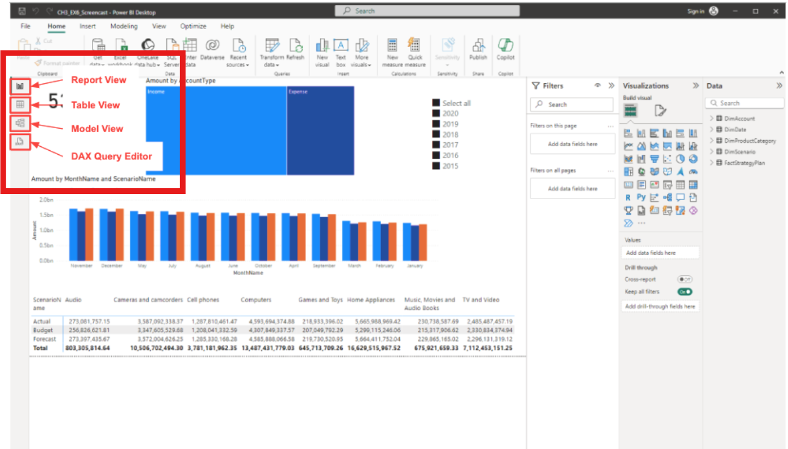

### Canvas

Hình ảnh báo cáo
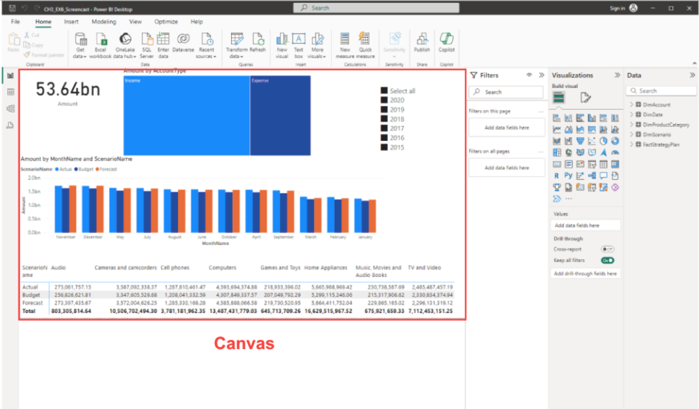

### Filters pane

Lọc hình ảnh dữ liệu
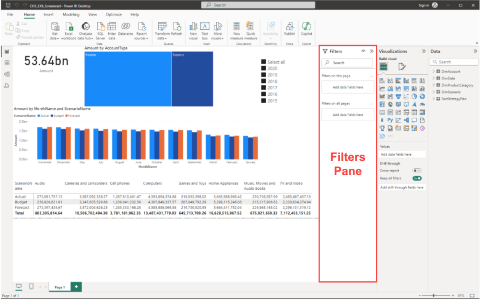

### Visualizations Pane

Thêm, thay đổi, tuỳ chỉnh data visualization
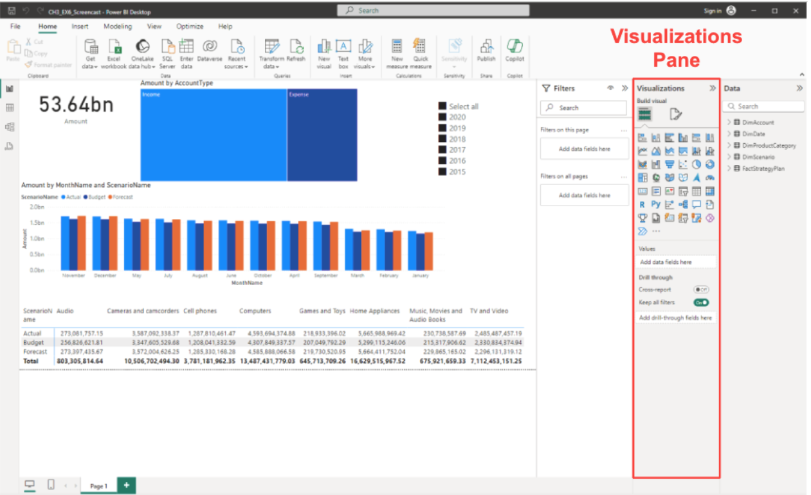

### Data Pane

* Hiển thị trường dữ liệu có sẵn
* Kéo trường vào Canvas, Filters pane, Visualizations Pane để tạo hoặc sửa đổi data visualization

---

## Connect Data

#### Step 1

Home → Get Data (Trong tab Home)

#### Step 2

Chọn loại file → Chọn file

#### Step 3

Cửa sổ preview xuất hiện → Chọn **Load**

---

## Xem raw data

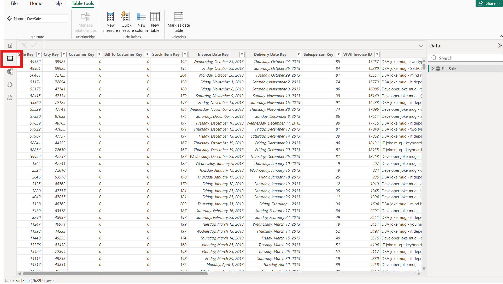

---

## Combine data from multi source

* Chỉ cần load thêm file vào

### Model view

Có thể xem tất cả các bảng
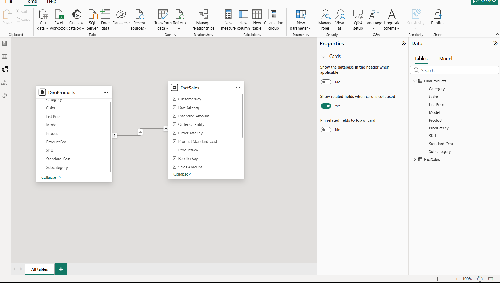

* Tự kết nối các liên kết

#### Xoá liên kết

Chuột phải vào liên kết → Delete

#### Tạo liên kết thủ công

Kéo trường từ bảng này sang trường tương ứng của bảng khác

---

## Tạo visual

Vào Report view
Chọn các trường trong Data pane

---

## Slicers and Tables

### Slicers

Slicer là một công cụ lọc dữ liệu trực quan trên báo cáo.

Nó cho phép người dùng:

* Chọn năm
* Chọn danh mục
* Chọn khu vực
* Chọn sản phẩm
* v.v.

→ Tất cả biểu đồ trong trang sẽ thay đổi theo lựa chọn đó.

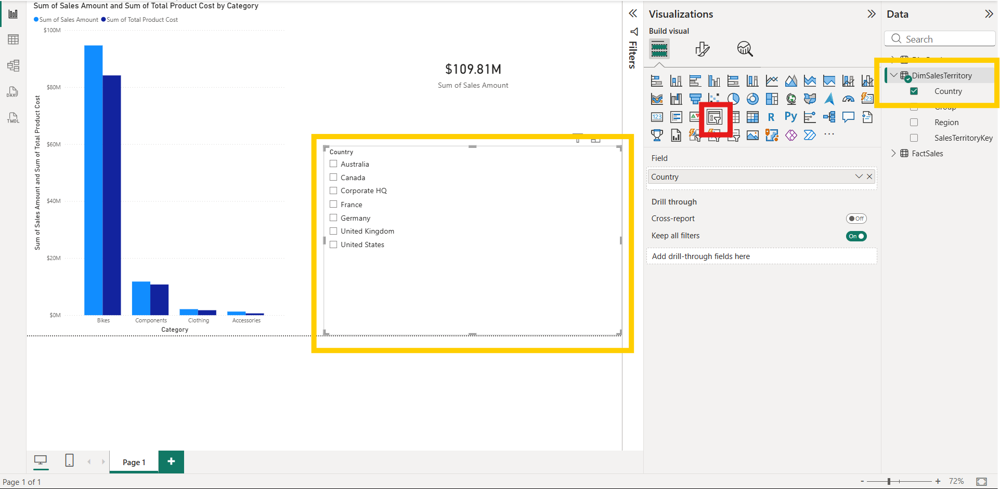

#### Khi nào dùng Slicer?

* Khi muốn người xem tự lọc dữ liệu
* Khi làm dashboard tương tác
* Khi cần so sánh theo thời gian, khu vực, sản phẩm

---

### Table

Table là visual hiển thị dữ liệu dạng bảng (giống Excel).

Nó hiển thị:

* Cột
* Dòng
* Giá trị chi tiết

# Transforming data

* Data thô ko hoàn hảo để đáp ứng các yêu cầu -> Chuyển data phù hợp với nhu cầu

## Cleaning data
Loại biến đổi liên quan đến:
- Thừa cột
- Dữ liệu có định dạng bất tiện
- Dữ liệu không nhất quán
- Thừa kí tự, dòng trống
- v.v ...

## Loading data
Trước khi load data cần transform trước
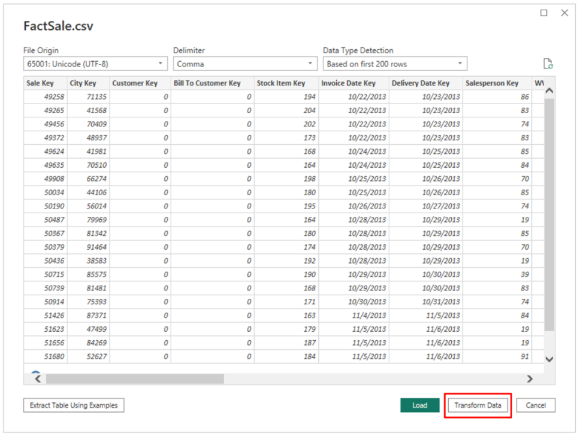

Sử dụng Power Query Editor — một công cụ cho phép chỉnh sửa dữ liệu trước khi tải vào.

Dùng nó để:

- Định dạng lại bộ dữ liệu

- Quyết định những gì sẽ được tải vào

Power Query mở ra trong một cửa sổ riêng và sử dụng một ngôn ngữ M

## Power Query Editor
B1: Get Data

B2: Chọn Transform

B3:
- Nếu cần xoá hàng và cột thừa:
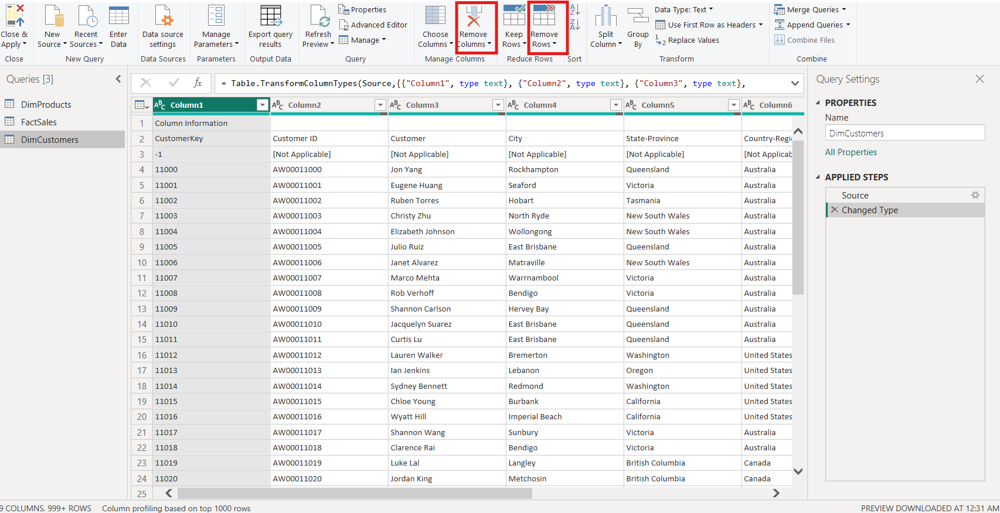

- Log thay đổi:
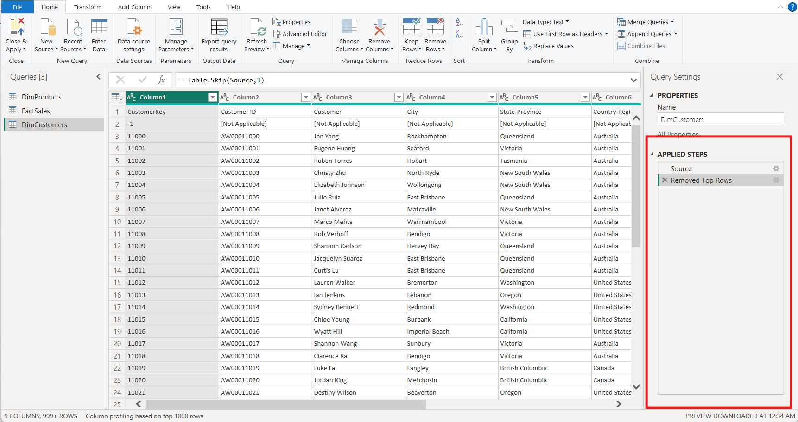

B4: Chọn Close and apply

*Cách mở khi ở report view*
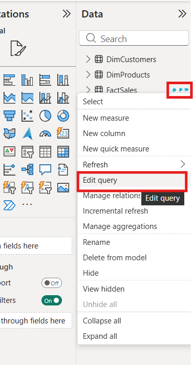

## Transforming and formatting columns
### Làm sạch & biến đổi dữ liệu (Transform data)

- Mở Power Query Editor bằng cách chọn Transform data.

- Kiểm tra bảng Microsoft Power BI (ví dụ: DimProducts).

- Kiểm tra Data Type của từng cột:

  - Standard Cost → Decimal Number.

  - Color → Text.

- Phát hiện lỗi dữ liệu:

- Cột Subcategory có dấu ? ở đầu mỗi giá trị.

- Sử dụng Replace Values để thay ? bằng khoảng trắng.

- Chọn Close & Apply để lưu thay đổi.

## Định dạng cột (Formatting Columns)

- Vào Table View.

- Chọn cột (Standard Cost).

- Trong Column Tools:

  - Đổi Format → Currency.

  - Chỉnh Decimal Places → 0.

- Có thể thay đổi Default Summarization (ví dụ: Average, Sum, Count).

### Phân loại dữ liệu địa lý (Data Categories)

- Trong bảng có các cột địa lý:
- Gán Data Category (City, Country…) để Power BI nhận diện dữ liệu địa lý.
- Biểu tượng 🌍 xuất hiện khi cột được nhận diện đúng.

### Tạo bản đồ (Map Visualization)
Thêm Map Visual.

Location → Country-Region.

Bubble size → SalesOrderLineKey (Count).

Kích thước vòng tròn tỷ lệ với số đơn hàng theo quốc gia.

# Visualizing Data
## Visualization options
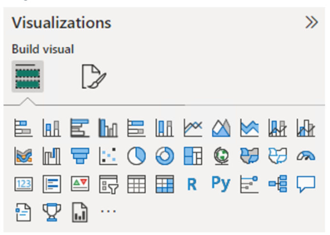

### Column and bar charts
Dùng để so sánh giá trị giữa các nhóm.

**Bar chart**\
Thanh nằm ngang
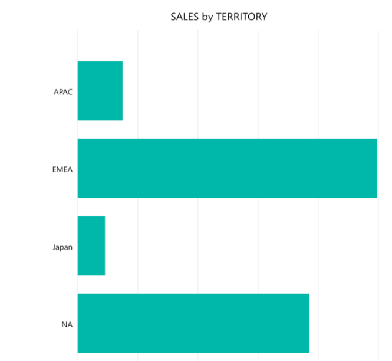

**Column chart**\
Thanh nằm dọc
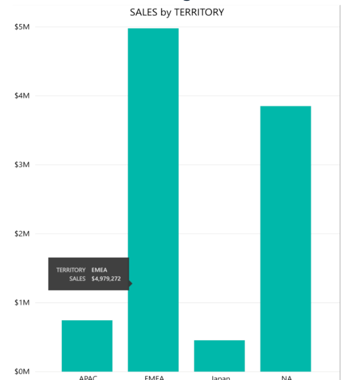

**Các biến thể**
- *Stacked bar and column chart*\
Các phần chồng lên nhau trong cùng một cột/thanh (tổng = toàn bộ thanh)
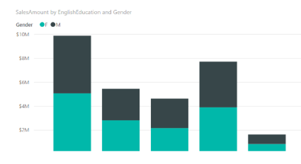
- *Clustered bar and column chart*\
Nhiều cột đặt cạnh nhau
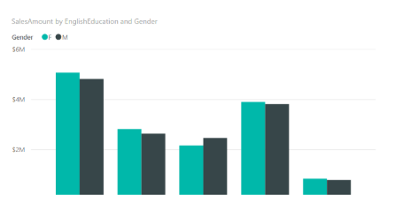
- *100% Stacked*\
 → Thể hiện tỷ lệ %, mỗi thanh luôn = 100%
 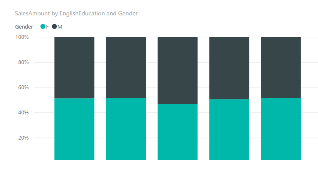
 - *Combo chart*\
 Kết hợp Column chart và Line chart
 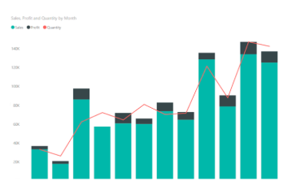
 
 ### Line chart
 - Hiển thị nhiều đường trong một biểu đồ
- Thường dùng để thể hiện xu hướng theo thời gian
 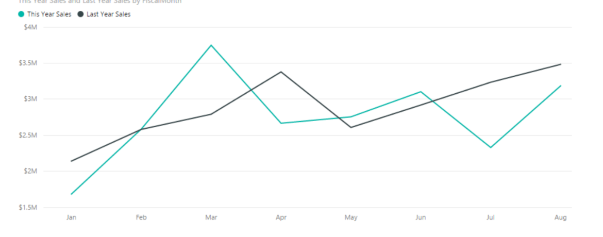

 ### Area chart
- Dựa trên line chart
- Phần giữa trục và đường được tô màu
 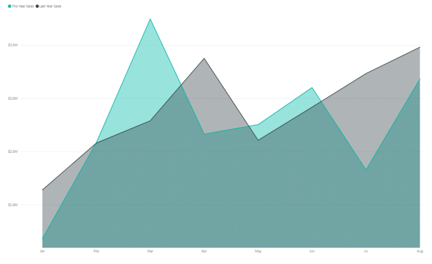

 ### Pie chart và Donut chart
- Thể hiện mối quan hệ phần – tổng
- Donut chart giống pie chart nhưng có lỗ ở giữa
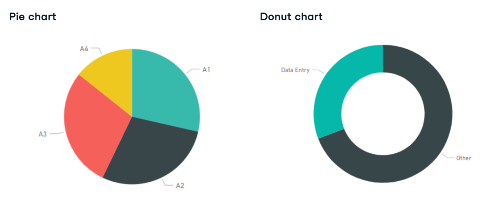
### Treemap
- Cũng thể hiện mối quan hệ phần – tổng
- Dùng các hình chữ nhật có kích thước khác nhau để biểu diễn giá trị
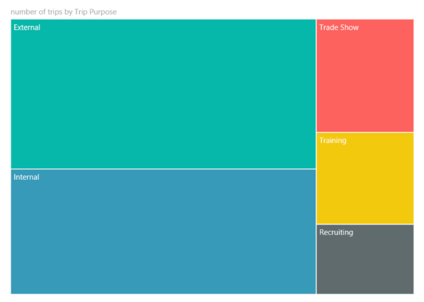
### Nhóm biểu đồ hiển thị hiệu suất
Dùng để hiển thị 1 hoặc vài chỉ số tổng quan:
- Card → Hiển thị 1 giá trị
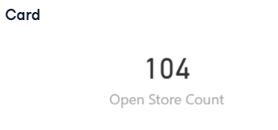
- Multi-row card → Nhiều giá trị
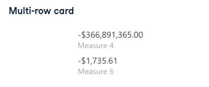
- Gauge và KPI → So sánh thực tế với mục tiêu/kế hoạch
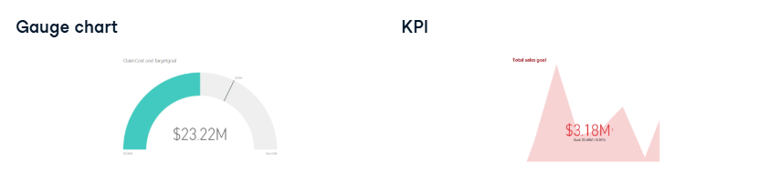
### Table and matrix
**Table**

Dạng bảng gồm hàng và cột

Có thể có tiêu đề và dòng tổng

**Matrix**

Tương tự Table

Có thể mở rộng (expand) / thu gọn (collapse) theo hàng hoặc cột

Phù hợp khi phân tích theo nhiều cấp độ (ví dụ: vùng, sản phẩm…)

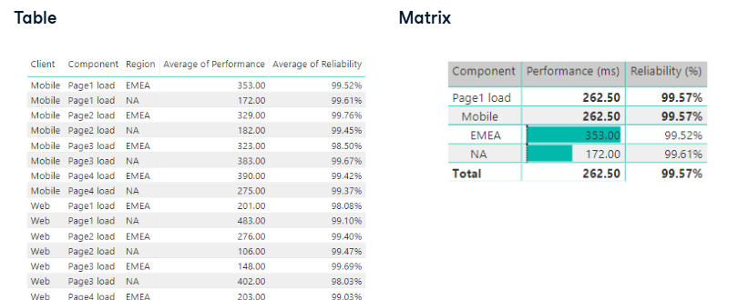

### Editing visualizations
Tất cả biểu đồ có thể chỉnh sửa bằng biểu tượng cây cọ (paint brush) trong Power BI.
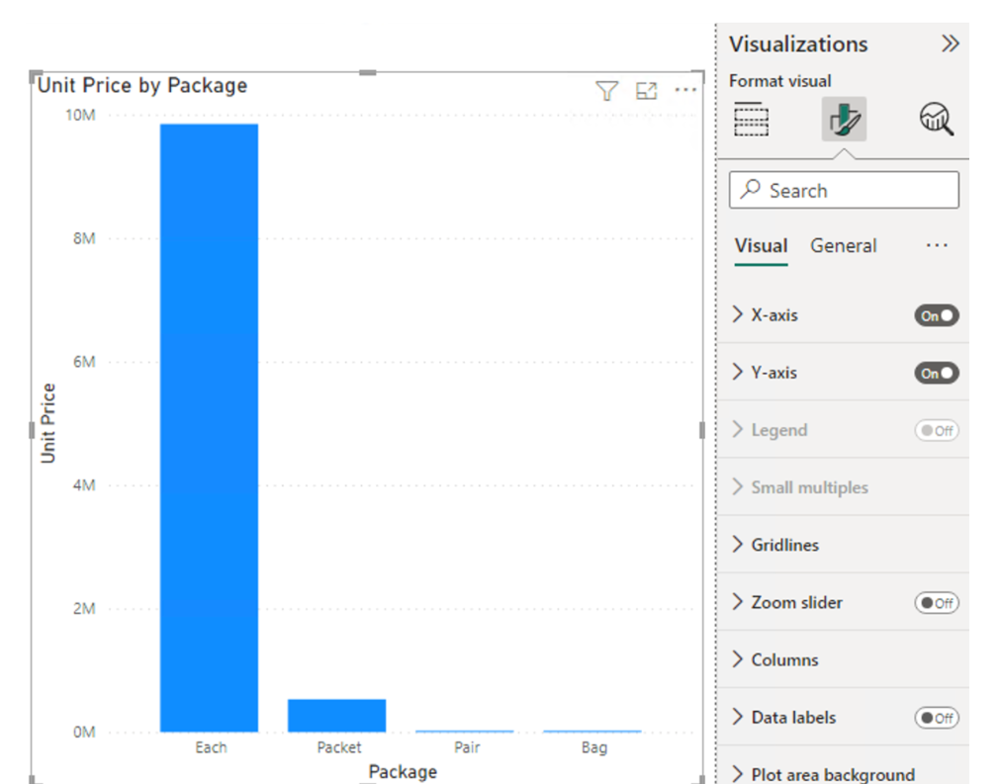
## Sorting
Step:
- Nhấp vào dấu ba chấm ở góc trên phải của axis
- Chọn sort axis 
-> Chọn
  - Sort theo trường nào
  - Sort theo nhu cầu nào

**Dùng tính năng Sort By Column:**

- Chuyển sang Data view

- Chọn bảng (ví dụ: DimDate)

- Chọn cột MonthName

- Chọn Sort By Column → MonthNumber 

# Filter
## Drilling down and filtering
### Drilling down
Drill down cho phép:
- Xem dữ liệu ở mức tổng quát (ví dụ: Year)
- Sau đó đi sâu hơn (Quarter → Month → Day)

Drill down hoạt động nhờ Hierarchy -> điều hướng giữa các cấp độ dữ liệu

**Drill down trong Power BI**
- Hiện chi tiết các trường cùng lúc
  Ví dụ:

  Year → Quarter (cho tất cả năm)

  Quarter → Month (cho tất cả năm)

  ⚠ Lưu ý:
  Tháng January lúc này = tổng January của nhiều năm cộng lại.
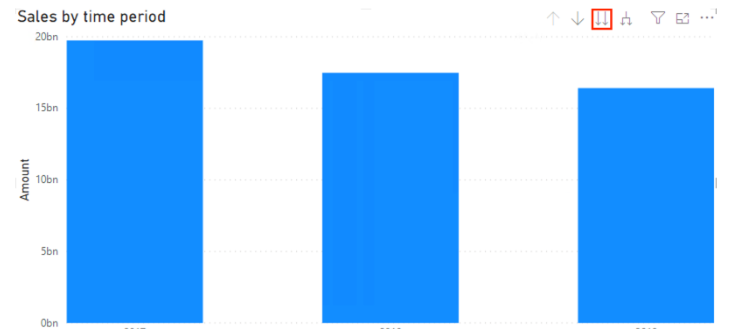
- Thêm một cấp độ phân cấp vào chế độ xem hiện tại
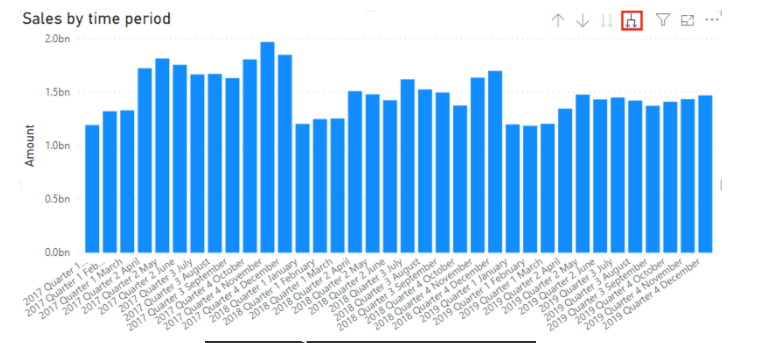

### Filtering
Chỉ hiển thị dữ liệu theo điều kiện
**Các cấp độ Filter**
- Visual-level filter → Chỉ áp dụng cho 1 biểu đồ
- Page-level filter → Áp dụng cho toàn bộ 1 trang report
- Report-level filter → Áp dụng cho toàn bộ báo cáo

**Turn off filtering**

Khi không muốn người dùng thay đổi filter.

=> Sử dụng Edit Interactions

Khi tắt tương tác:

Visual sẽ không thay đổi dù user chọn field khác

1. Vào tab **Format**
2. Chọn **Edit Interactions**
3. Chọn visual cần kiểm soát (ví dụ: Monthly Amount)
4. Trên các visual khác sẽ xuất hiện:
   - 🔵 Filter icon
   - 🚫 None icon
5. Chọn 🚫 để tắt tương tác

**Cách thực hiện Visual-level Filter**
1. Chọn visual
2. Trong Filter pane (bên phải), chọn trường muốn lọc
3. Chọn kiểu lọc
4. Chọn trường dùng để xếp hạng
6. Nhấn **Apply filter**

**Cách thực hiện Report-level Filter**
1. Kéo trường cần lọc vào mục **Filters on all pages**
2. Tiến hành lọc theo nhu cầu

Ngoài Report-level filter, bạn cũng có thể:
- Kéo field vào **Filters on this page**
- Áp dụng cho một trang duy nhất

### Underlying Data
Xem bảng dữ liệu dùng để tạo biểu đồ

**Cách làm:**
- Nhấn ba dấu chấm (…) trên visual
- Chọn **Show as a Table**

Kết quả:
- Hiển thị biểu đồ
- Hiển thị bảng dữ liệu tạo nên biểu đồ

### Tạo Hierarchy
Bước 1: Vào Table View

Bước 2: Tạo hierarchy
- Nhấn ba chấm ở cột 
- Chọn **Create hierarchy**
- Đổi tên (ví dụ: Date Rollup)

Bước 3: Thêm các cột vào hierarchy
- Right click vào trường → Add to hierary

### Thay đổi thứ tự level

- Vào **Model View**
- Chọn hierarchy
- Trong Properties pane → chỉnh lại thứ tự các level

